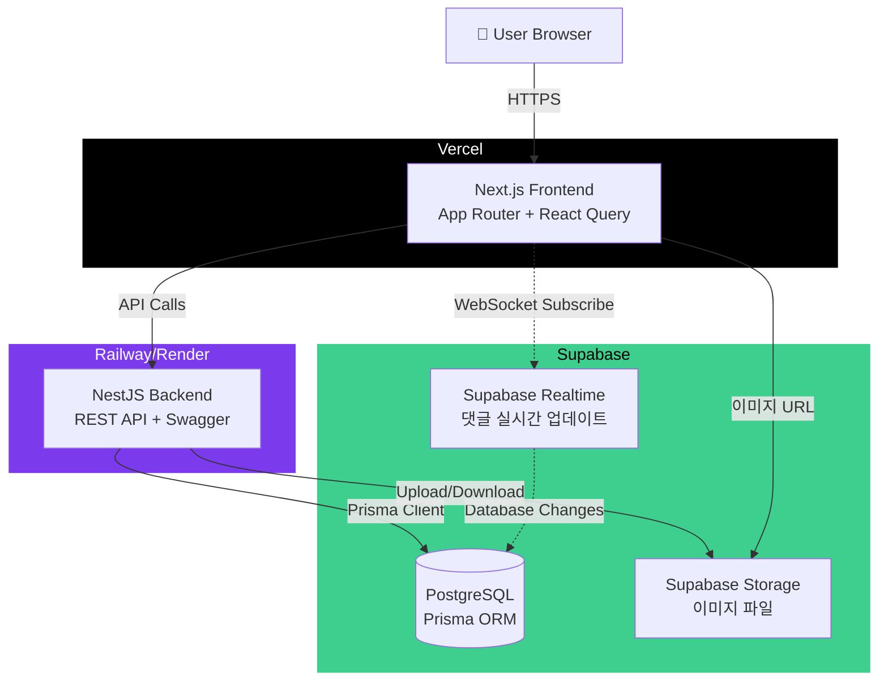

# WhisperBoard Fullstack Architecture Document

## Introduction

이 문서는 WhisperBoard의 전체 Full-stack 아키텍처를 정의합니다. Frontend(Next.js), Backend(NestJS), Database(Supabase PostgreSQL)를 포함한 통합 시스템 설계를 제공하며, AI 기반 개발의 단일 진실 공급원(Single Source of Truth)으로 기능합니다.

WhisperBoard는 완전 익명 게시판 플랫폼으로, 계정 없이 즉시 참여 가능하며 랜덤 닉네임/색상, 실시간 댓글, 반응 시스템 등 재미있는 인터랙티브 요소를 제공합니다. 이는 Supabase의 핵심 기능(Realtime, Storage, RLS)을 학습하는 토이 프로젝트이자 실제 사용 가능한 제품을 목표로 합니다.

### Starter Template or Existing Project

**N/A - Greenfield 프로젝트**

WhisperBoard는 처음부터 새로 구축하는 프로젝트입니다. 기존 템플릿을 사용하지 않으며, PRD에 명시된 기술 스택(Next.js 14 App Router, NestJS, Supabase, Prisma)을 기반으로 커스텀 구조를 설계합니다.

### Change Log

| Date | Version | Description | Author |
|------|---------|-------------|--------|
| 2025-10-15 | 0.1 | 초기 Architecture 문서 작성 시작 | Winston (Architect) |

## High Level Architecture

### Technical Summary

WhisperBoard는 **Monolith 기반 분리형 Fullstack 아키텍처**를 채택합니다. Frontend는 Next.js 14 App Router로 정적 생성 및 서버 사이드 렌더링을 활용하고, Backend는 NestJS로 RESTful API를 제공합니다. Supabase PostgreSQL을 Primary Database로 사용하며, Prisma ORM을 통해 타입 안전한 쿼리를 보장합니다. Supabase Realtime을 활용한 실시간 댓글 업데이트와 Supabase Storage를 통한 이미지 관리가 핵심 통합 지점입니다. Vercel(Frontend)과 Railway/Render(Backend)를 배포 플랫폼으로 사용하여 빠른 MVP 출시를 지원하며, Supabase 무료 티어 내에서 운영 가능하도록 설계되었습니다.

### Platform and Infrastructure Choice

**Platform:** Vercel (Frontend), Railway 또는 Render (Backend), Supabase (Database & Services)

**Key Services:**
- **Vercel**: Next.js 호스팅, Edge Functions, 자동 배포
- **Supabase**: PostgreSQL Database, Realtime, Storage, Row Level Security
- **Railway/Render**: NestJS Backend 호스팅 (Docker 컨테이너)

**Deployment Host and Regions:**
- Frontend: Vercel Edge Network (글로벌 CDN)
- Backend: Railway/Render (US East 또는 Asia Pacific 선택 가능)
- Database: Supabase (서울 리전 또는 도쿄 리전 권장)

### Repository Structure

**Structure:** Monorepo (단일 저장소)

**Monorepo Tool:** npm workspaces (또는 pnpm workspaces)

**Package Organization:**
- `frontend/`: Next.js 애플리케이션
- `backend/`: NestJS 애플리케이션
- `packages/shared/`: 공유 TypeScript 타입 및 유틸리티

### High Level Architecture Diagram



### Architectural Patterns

- **Jamstack Architecture:** 정적 생성(SSG) 및 서버 사이드 렌더링(SSR)을 활용한 성능 최적화 - _Rationale:_ Next.js App Router의 강점을 최대한 활용하여 빠른 초기 로딩과 SEO 최적화
- **RESTful API:** 명확한 리소스 기반 API 설계 - _Rationale:_ Swagger 자동 문서화와 표준화된 HTTP 메서드로 개발 및 테스트 편의성 확보
- **Component-Based UI:** React 컴포넌트 기반 재사용 가능한 UI - _Rationale:_ Tailwind CSS와 함께 사용하여 일관된 디자인 시스템 구축
- **Repository Pattern:** Prisma를 통한 데이터 접근 계층 추상화 - _Rationale:_ 비즈니스 로직과 데이터 액세스 분리로 테스트 용이성 및 유지보수성 향상
- **Session-Based Anonymous System:** LocalStorage 세션 ID 기반 사용자 구분 - _Rationale:_ 계정 없이도 반응 및 중복 방지 기능 구현
- **Event-Driven Realtime:** Supabase Realtime을 통한 실시간 이벤트 처리 - _Rationale:_ 댓글 작성 시 모든 접속 사용자에게 즉시 반영

## Tech Stack

| Category | Technology | Version | Purpose | Rationale |
|----------|-----------|---------|---------|-----------|
| Frontend Language | TypeScript | 5.7+ | 타입 안전한 Frontend 개발 | Next.js 15와의 완벽한 통합, 런타임 에러 방지, IDE 자동완성 지원 |
| Frontend Framework | Next.js | 15 (App Router) | React 기반 Fullstack 프레임워크 | React 19 지원, Turbopack, 개선된 캐싱, Vercel 최적화 |
| UI Component Library | Tailwind CSS | 4.x | Utility-first CSS 프레임워크 | 빠른 스타일링, 모바일 반응형, 커스터마이징 용이, 작은 번들 크기 |
| State Management | Zustand | 5.x | 경량 전역 상태 관리 | Redux보다 간단한 API, TypeScript 지원, 세션 관리에 최적 |
| Server State Management | React Query (TanStack Query) | 5.x | 서버 상태 및 캐싱 관리 | API 호출 최적화, 자동 캐싱, 낙관적 업데이트 지원 |
| Form Handling | React Hook Form | 7.x | 폼 상태 관리 및 검증 | 성능 최적화, Zod 통합, 최소 리렌더링 |
| Form Validation | Zod | 3.x | TypeScript 기반 스키마 검증 | 타입 추론, Frontend/Backend 스키마 공유, 명확한 에러 메시지 |
| Backend Language | TypeScript | 5.7+ | 타입 안전한 Backend 개발 | Frontend와 동일 언어로 일관성 확보, Prisma 타입 안전성 |
| Backend Framework | NestJS | 11.x | Node.js Enterprise Framework | 모듈화 구조, DI 패턴, Swagger 자동 문서화, TypeScript 기본 지원 |
| API Style | REST API | - | HTTP 기반 RESTful API | 표준화, Swagger 통합, 단순성, 학습 곡선 낮음 |
| Database | PostgreSQL (Supabase) | 15+ | 관계형 데이터베이스 | Supabase 제공, ACID 보장, JSON 지원, 강력한 쿼리 기능 |
| ORM | Prisma | 5.x | TypeScript ORM | 타입 안전 쿼리, 마이그레이션 관리, Supabase 통합, Prisma Studio |
| Cache | In-Memory (Node.js Map) | - | 간단한 서버 사이드 캐싱 | MVP에 충분, Redis 추가 없이 Rate Limiting 구현 가능 |
| File Storage | Supabase Storage | - | 이미지 파일 저장소 | Supabase 통합, CDN 제공, Public URL 생성, 5MB 파일 업로드 지원 |
| Authentication | Session-based (Custom) | - | 세션 ID 기반 익명 인증 | LocalStorage + UUID, 계정 불필요, 반응 시스템 지원 |
| Realtime | Supabase Realtime | - | WebSocket 기반 실시간 업데이트 | PostgreSQL 변경 감지, 댓글 실시간 동기화 |
| Frontend Testing | Jest + React Testing Library | Jest 29.x, RTL 16.x | 컴포넌트 유닛/통합 테스트 | Next.js 기본 설정, 사용자 중심 테스트 |
| Backend Testing | Jest + Supertest | Jest 29.x | API 엔드포인트 통합 테스트 | NestJS 기본 설정, HTTP 테스트 용이 |
| E2E Testing | Playwright | 1.x | 브라우저 자동화 E2E 테스트 | Vercel 권장, 크로스 브라우저 지원 (MVP에서는 선택) |
| Build Tool | npm scripts | - | 패키지 관리 및 빌드 스크립트 | Monorepo workspaces 지원, 추가 도구 불필요 |
| Bundler | Next.js (Turbopack) / Webpack | - | Frontend 번들링 | Next.js 14 기본 번들러, 최적화된 빌드 |
| IaC Tool | N/A (Manual Setup) | - | 인프라 코드화 | MVP는 수동 설정, 추후 Terraform 고려 |
| CI/CD | GitHub Actions | - | 자동 빌드 및 배포 | Vercel/Railway 통합, 무료 티어, YAML 설정 |
| Monitoring | Vercel Analytics + Supabase Dashboard | - | 성능 및 데이터베이스 모니터링 | Vercel 기본 제공, Supabase 무료 대시보드 |
| Logging | Console + Supabase Logs | - | 애플리케이션 로깅 | 개발 환경 console.log, Supabase 로그 뷰어 |
| API Documentation | Swagger (NestJS) | - | REST API 자동 문서화 | NestJS 데코레이터 기반 자동 생성, 테스트 UI 제공 |
| Icons | Heroicons 또는 Lucide Icons | 2.x | React 아이콘 컴포넌트 | Tailwind 호환, Tree-shaking, SVG 최적화 |
| Image Optimization | Next.js Image Component | - | 이미지 최적화 및 lazy loading | 자동 WebP 변환, 반응형 이미지, CLS 방지 |

## Data Models

### Post (게시글)

**Purpose:** 사용자가 작성하는 익명 게시글을 표현하는 핵심 엔티티

**TypeScript Interface:**

```typescript
interface Post {
  id: string;
  title: string;
  content: string;
  category: string | null;
  anonymous_name: string;
  anonymous_color: string;
  password_hash: string | null;
  ip_hash: string;
  view_count: number;
  created_at: Date;
  updated_at: Date;
  deleted_at: Date | null;
  // Relations
  comments?: Comment[];
  images?: Image[];
  reactions?: Reaction[];
}
```

**Relationships:**
- Has Many: Comment, Image, Reaction

### Comment (댓글)

**Purpose:** 게시글에 대한 댓글 및 대댓글을 표현하는 트리 구조 엔티티

**TypeScript Interface:**

```typescript
interface Comment {
  id: string;
  post_id: string;
  parent_id: string | null;
  content: string;
  depth: number;
  anonymous_name: string;
  anonymous_color: string;
  password_hash: string | null;
  ip_hash: string;
  is_op: boolean;
  created_at: Date;
  updated_at: Date;
  deleted_at: Date | null;
  // Relations
  post?: Post;
  parent?: Comment;
  children?: Comment[];
  reactions?: Reaction[];
}
```

**Relationships:**
- Belongs To: Post, Comment (self-referential)
- Has Many: Comment (children), Reaction

### Reaction (반응)

**Purpose:** 게시글 및 댓글에 대한 좋아요/싫어요 반응

**TypeScript Interface:**

```typescript
type TargetType = 'post' | 'comment';
type ReactionType = 'like' | 'dislike';

interface Reaction {
  id: string;
  target_type: TargetType;
  target_id: string;
  reaction_type: ReactionType;
  session_id: string;
  created_at: Date;
}
```

### Image (이미지)

**TypeScript Interface:**

```typescript
interface Image {
  id: string;
  post_id: string;
  file_path: string;
  file_size: number;
  created_at: Date;
}
```

### Report (신고)

**TypeScript Interface:**

```typescript
type ReportStatus = 'pending' | 'reviewed' | 'actioned';

interface Report {
  id: string;
  target_type: TargetType;
  target_id: string;
  reason: string;
  status: ReportStatus;
  reporter_ip_hash: string;
  created_at: Date;
}
```

## Database Schema

### Prisma Schema

```prisma
// prisma/schema.prisma

generator client {
  provider = "prisma-client-js"
}

datasource db {
  provider = "postgresql"
  url      = env("DATABASE_URL")
}

model Post {
  id              String    @id @default(uuid())
  title           String
  content         String    @db.Text
  category        String?
  anonymous_name  String
  anonymous_color String
  password_hash   String?
  ip_hash         String
  view_count      Int       @default(0)
  created_at      DateTime  @default(now())
  updated_at      DateTime  @updatedAt
  deleted_at      DateTime?

  comments  Comment[]
  images    Image[]
  reactions Reaction[]

  @@index([created_at])
  @@index([category])
  @@index([deleted_at])
  @@map("posts")
}

model Comment {
  id              String    @id @default(uuid())
  post_id         String
  parent_id       String?
  content         String    @db.Text
  depth           Int       @default(0)
  anonymous_name  String
  anonymous_color String
  password_hash   String?
  ip_hash         String
  is_op           Boolean   @default(false)
  created_at      DateTime  @default(now())
  updated_at      DateTime  @updatedAt
  deleted_at      DateTime?

  post      Post       @relation(fields: [post_id], references: [id], onDelete: Cascade)
  parent    Comment?   @relation("CommentToComment", fields: [parent_id], references: [id])
  children  Comment[]  @relation("CommentToComment")
  reactions Reaction[]

  @@index([post_id])
  @@index([parent_id])
  @@index([created_at])
  @@index([deleted_at])
  @@map("comments")
}

model Reaction {
  id            String   @id @default(uuid())
  target_type   String   // 'post' | 'comment'
  target_id     String
  reaction_type String   // 'like' | 'dislike'
  session_id    String
  created_at    DateTime @default(now())

  @@unique([target_type, target_id, session_id])
  @@index([target_type, target_id])
  @@index([session_id])
  @@map("reactions")
}

model Image {
  id         String   @id @default(uuid())
  post_id    String
  file_path  String
  file_size  Int
  created_at DateTime @default(now())

  post Post @relation(fields: [post_id], references: [id], onDelete: Cascade)

  @@index([post_id])
  @@map("images")
}

model Report {
  id                String   @id @default(uuid())
  target_type       String   // 'post' | 'comment'
  target_id         String
  reason            String
  status            String   @default("pending") // 'pending' | 'reviewed' | 'actioned'
  reporter_ip_hash  String
  created_at        DateTime @default(now())

  @@index([target_type, target_id])
  @@index([status])
  @@map("reports")
}
```

### Index 전략

**성능 최적화를 위한 인덱스:**
- `posts`: created_at (정렬), category (필터링), deleted_at (Soft Delete 쿼리)
- `comments`: post_id (조회), parent_id (트리 구조), created_at, deleted_at
- `reactions`: (target_type, target_id, session_id) 복합 유니크 인덱스
- `images`: post_id (조회)
- `reports`: (target_type, target_id), status

## API Specification

### REST API Endpoints

#### Posts API

```yaml
# GET /api/posts
summary: 게시글 목록 조회
parameters:
  - name: category
    in: query
    schema: { type: string }
  - name: page
    in: query
    schema: { type: integer, default: 1 }
  - name: limit
    in: query
    schema: { type: integer, default: 20 }
  - name: sort
    in: query
    schema: { type: string, enum: [latest, popular, views], default: latest }
response:
  200:
    data: Post[]
    meta: { total: number, page: number, totalPages: number }

# POST /api/posts
summary: 게시글 작성
requestBody:
  title: string
  content: string
  category?: string
  password?: string
  imageIds?: string[]
response:
  201: { data: Post }
  429: { error: "Rate limit exceeded" }

# GET /api/posts/:id
summary: 게시글 상세 조회
response:
  200: { data: Post & { images: Image[], comments: Comment[] } }
  404: { error: "Post not found" }

# PATCH /api/posts/:id
summary: 게시글 수정
requestBody:
  title?: string
  content?: string
  password: string (required)
response:
  200: { data: Post }
  401: { error: "Invalid password" }

# DELETE /api/posts/:id
summary: 게시글 삭제 (Soft Delete)
requestBody:
  password: string (required)
response:
  200: { message: "Post deleted" }
  401: { error: "Invalid password" }

# GET /api/posts/search
summary: 게시글 검색
parameters:
  - name: q
    in: query
    required: true
    schema: { type: string }
response:
  200: { data: Post[], meta: { total: number } }
```

#### Comments API

```yaml
# GET /api/posts/:postId/comments
summary: 댓글 목록 조회 (트리 구조)
response:
  200: { data: Comment[] } # 트리 구조로 반환

# POST /api/posts/:postId/comments
summary: 댓글 작성
requestBody:
  content: string
  parentId?: string
  password?: string
response:
  201: { data: Comment }

# PATCH /api/comments/:id
summary: 댓글 수정
requestBody:
  content: string
  password: string
response:
  200: { data: Comment }

# DELETE /api/comments/:id
summary: 댓글 삭제
requestBody:
  password: string
response:
  200: { message: "Comment deleted" }
```

#### Reactions API

```yaml
# POST /api/reactions
summary: 반응 추가/제거/변경
requestBody:
  targetType: 'post' | 'comment'
  targetId: string
  reactionType: 'like' | 'dislike'
  sessionId: string
response:
  200: { data: { likeCount: number, dislikeCount: number } }
```

#### Images API

```yaml
# POST /api/images
summary: 이미지 업로드
requestBody: multipart/form-data
  file: File (max 5MB)
response:
  201: { data: { id: string, url: string } }
  400: { error: "File too large" }
```

#### Reports API

```yaml
# POST /api/reports
summary: 신고 접수
requestBody:
  targetType: 'post' | 'comment'
  targetId: string
  reason: string
response:
  201: { message: "Report submitted" }
```

## Unified Project Structure

```
whisper-board/
├── .github/
│   └── workflows/
│       ├── frontend-ci.yml
│       └── backend-ci.yml
├── frontend/                          # Next.js Application
│   ├── app/
│   │   ├── (main)/
│   │   │   ├── page.tsx              # 게시글 목록
│   │   │   ├── posts/
│   │   │   │   ├── [id]/
│   │   │   │   │   └── page.tsx      # 게시글 상세
│   │   │   │   └── new/
│   │   │   │       └── page.tsx      # 글 작성
│   │   │   └── search/
│   │   │       └── page.tsx          # 검색
│   │   ├── layout.tsx
│   │   └── globals.css
│   ├── components/
│   │   ├── post/
│   │   │   ├── PostCard.tsx
│   │   │   ├── PostDetail.tsx
│   │   │   ├── PostForm.tsx
│   │   │   └── PostList.tsx
│   │   ├── comment/
│   │   │   ├── CommentItem.tsx
│   │   │   ├── CommentForm.tsx
│   │   │   └── CommentTree.tsx
│   │   └── ui/
│   │       ├── Button.tsx
│   │       ├── Modal.tsx
│   │       └── Input.tsx
│   ├── hooks/
│   │   ├── usePost.ts
│   │   ├── useComment.ts
│   │   ├── useReaction.ts
│   │   └── useSession.ts
│   ├── lib/
│   │   ├── api-client.ts             # Axios instance
│   │   ├── supabase-client.ts        # Supabase client
│   │   └── utils.ts
│   ├── stores/
│   │   └── sessionStore.ts           # Zustand
│   ├── types/
│   │   └── index.ts                  # Shared types
│   ├── public/
│   ├── .env.local
│   ├── next.config.js
│   ├── tailwind.config.ts
│   └── package.json
├── backend/                           # NestJS Application
│   ├── src/
│   │   ├── posts/
│   │   │   ├── posts.controller.ts
│   │   │   ├── posts.service.ts
│   │   │   ├── posts.module.ts
│   │   │   └── dto/
│   │   │       ├── create-post.dto.ts
│   │   │       └── update-post.dto.ts
│   │   ├── comments/
│   │   │   ├── comments.controller.ts
│   │   │   ├── comments.service.ts
│   │   │   └── comments.module.ts
│   │   ├── reactions/
│   │   │   ├── reactions.controller.ts
│   │   │   └── reactions.service.ts
│   │   ├── images/
│   │   │   ├── images.controller.ts
│   │   │   └── images.service.ts
│   │   ├── reports/
│   │   │   ├── reports.controller.ts
│   │   │   └── reports.service.ts
│   │   ├── common/
│   │   │   ├── guards/
│   │   │   │   └── rate-limit.guard.ts
│   │   │   ├── decorators/
│   │   │   │   └── ip-address.decorator.ts
│   │   │   └── filters/
│   │   │       └── http-exception.filter.ts
│   │   ├── prisma/
│   │   │   ├── prisma.service.ts
│   │   │   └── prisma.module.ts
│   │   ├── utils/
│   │   │   ├── anonymous-name.generator.ts
│   │   │   ├── password.helper.ts
│   │   │   └── ip-hash.helper.ts
│   │   ├── app.module.ts
│   │   └── main.ts
│   ├── prisma/
│   │   ├── schema.prisma
│   │   └── migrations/
│   ├── test/
│   ├── .env
│   ├── nest-cli.json
│   └── package.json
├── packages/
│   └── shared/                        # Shared types & utils
│       ├── src/
│       │   ├── types/
│       │   │   ├── post.types.ts
│       │   │   ├── comment.types.ts
│       │   │   └── index.ts
│       │   └── constants/
│       │       └── index.ts
│       └── package.json
├── docs/
│   ├── prd.md
│   └── architecture.md
├── .gitignore
├── .env.example
├── package.json                       # Root workspace
├── pnpm-workspace.yaml               # or npm workspaces
└── README.md
```

## Development Workflow

### Prerequisites

```bash
# Node.js 18+
node --version

# pnpm (or npm)
npm install -g pnpm

# Supabase CLI (optional)
npm install -g supabase
```

### Initial Setup

```bash
# Clone repository
git clone <repository-url>
cd whisper-board

# Install dependencies
pnpm install

# Setup environment variables
cp .env.example .env
# Edit .env with your Supabase credentials

# Setup database
cd backend
npx prisma migrate dev
npx prisma generate
cd ..
```

### Development Commands

```bash
# Start all services (from root)
pnpm dev

# Start frontend only
cd frontend && pnpm dev

# Start backend only
cd backend && pnpm start:dev

# Run Prisma Studio
cd backend && npx prisma studio

# Run tests
pnpm test

# Build for production
pnpm build
```

### Environment Variables

```bash
# Frontend (.env.local)
NEXT_PUBLIC_API_URL=http://localhost:3001/api
NEXT_PUBLIC_SUPABASE_URL=<your-supabase-url>
NEXT_PUBLIC_SUPABASE_ANON_KEY=<your-anon-key>

# Backend (.env)
DATABASE_URL=<your-supabase-postgres-url>
SUPABASE_URL=<your-supabase-url>
SUPABASE_SERVICE_KEY=<your-service-key>
PORT=3001
```

## Coding Standards

### Critical Fullstack Rules

- **Type Sharing:** 모든 공유 타입은 `packages/shared`에 정의하고 import
- **API Calls:** Frontend에서 직접 HTTP 호출 금지 - `lib/api-client.ts` 사용
- **Environment Variables:** `process.env` 직접 접근 금지 - config 객체 사용
- **Error Handling:** 모든 API 라우트는 NestJS Exception Filter 사용
- **State Updates:** Zustand/React Query 패턴 준수, 직접 mutate 금지
- **Prisma Queries:** Raw SQL 금지 - Prisma Client API 사용
- **Password Hashing:** bcrypt만 사용 (10 rounds)
- **IP Hashing:** SHA-256만 사용
- **File Upload:** Supabase Storage만 사용, 최대 5MB 검증

### Naming Conventions

| Element | Frontend | Backend | Example |
|---------|----------|---------|---------|
| Components | PascalCase | - | `PostCard.tsx` |
| Hooks | camelCase with 'use' | - | `useAuth.ts` |
| API Routes | - | kebab-case | `/api/posts` |
| Database Tables | - | snake_case | `user_posts` |
| DTO Classes | - | PascalCase | `CreatePostDto` |
| Services | - | PascalCase | `PostsService` |
